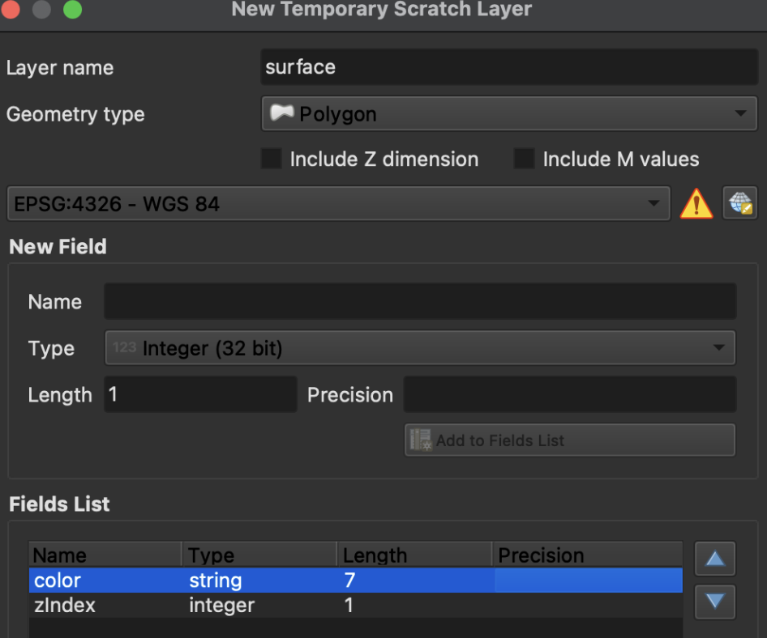

# Tower Cab Map Creation Tutorial (vZOB)

## Software Setup

1. **Install QGIS**  
   Download the Long-Term Release (LTR) from:  
   [https://qgis.org/download](https://qgis.org/download)

2. **Extract QGIS Tools ZIP**  
   Contains required styles (`Cab Polygons.qml`, `Cab Lines.qml`).

3. **Add ArcGIS Base Map**  
   Use this URL for the tile layer:  
   ```
   https://server.arcgisonline.com/ArcGIS/rest/services/World_Imagery/MapServer/tile/{z}/{y}/{x}
   ```
   Zoom into your desired airport (e.g., KLBE).

4. **Recommended Shortcuts**
   - Add Ring (hole): `H`
   - Copy/Move Feature: `C`
   - Vertex Tool (current layer): `V`  
   *(Customize via Settings → Keyboard Shortcuts)*

---

## 1. Create Layers

### Surface (Tarmac)
- Layer → Create Layer → New Temporary Scratch Layer
- **Name**: `surface`
- **Geometry**: Polygon
- **Fields**:
  - `color`: String (length 7)
  - `zIndex`: Integer (length 1)




- Apply style: `Cab Polygons.qml`
- Set fill color: `#717171`
- Stroke style: No line

---

## 2. Draw Features

### Surface Polygons
- Use the *Add Polygon Feature* tool
- Draw full tarmac area (include terminals/grassy zones initially)
- **Attributes**:
  - `color`: `#717171`
  - `zIndex`: `1`
- Set layer opacity (e.g. 50%) to see underneath
- Use **Ring Tool (H)** to cut out non-tarmac areas
- Save as **GeoPackage**
- Toggle editing (pencil icon) to save changes

---

## 3. Runway Markings

- Create a new **Polygon** layer named `markings`
- Use same fields as surface
- Style: `Cab Polygons.qml`
- Fill color: `#ffffff`
- zIndex: `2` (set default under Layer Properties → Attributes Form)
- Use copy/move (`C`) to duplicate common shapes
- Save as **GeoPackage**

---

## 4. Yellow Lines

- Create a **LineString** layer named `lines`
- Fields:
  - `color`: String (7)
  - `zIndex`: Integer (1)
  - `thickness`: Integer (1)
- Style: `Cab Lines.qml`
- Default values:
  - `color`: `#fcb737`
  - `zIndex`: `3`
  - `thickness`: `2`
- Draw features (hold shorts, chevrons, etc.)
- Save as **GeoPackage**

---

## 5. Export Layers to GeoJSON

- For each layer:
  - Right-click → Export → Save Features As...
  - **Format**: GeoJSON
  - **Uncheck**:
    - `Include FID`
    - `Persist Layer Metadata`
    - `Add Saved File to Map`

---

## 6. Combine GeoJSONs

1. Open all `.geojson` files in a code editor.
2. Choose one file (e.g., surface) as the base.
3. Copy features from other files into the `features` array.
   - Keep proper JSON formatting.
   - `color`: string (`"#fcb737"`)
   - `zIndex`, `thickness`: numeric (no quotes)
4. Confirm structure using:  
   [https://geojson.io](https://geojson.io)  
   Paste your combined features there and verify rendering.

---

## 7. Final Submission

Send the following to the FE department:
- Combined `.geojson`
- Individual `.gpkg` files
- `.qgz` QGIS project file

*(GitHub instructions to be added.)*